# 1. 시작하기에 앞서…

## 강의자 정보

<p align="left">
  
</p>

이름 : 김희우

학번 : 24학번

나이 : 05년생

본가 : 대구

MBTI : ENFP

잘하는 언어 : Python, 영어

인생 모토 : 최선만 다하자 (?)

## 코딩경력 (?)

<p align="left">
  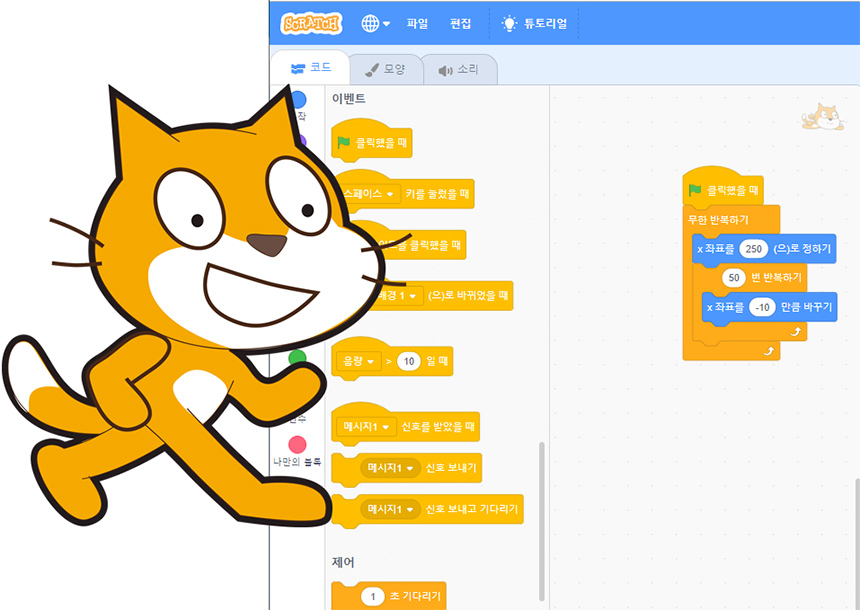
</p>

초등학교 4학년 : 게임을 하기 위해 코딩을 시작함 (스크래치)

그 후로 Python, C, JS, C++, HTML, CSS, Unity를 함

그 중에서 Python 개발 경험이 풍부함

- 파이썬 라이브러리
    - Turtle Graphics → 거북이로 장난치기
    - Tkinter → GUI 프로그램 만들기
    - Pygame → 게임 만들기
    - Selenium → 웹 크롤링 작업
    - BeautifulSoup4 → 웹 크롤링 작업
    - Django → 웹 프로그래밍 백엔드
    - Keras → 인공지능 라이브러리
    - PyTorch → 인공지능 라이브러리
    - Matplotlib → 데이터 시각화 라이브러리

---

# 2. 개발.. 왜 하나요?

<p align="left">
  
</p>


## 실전 경험 가능

- 학교 수업은 이론 중심
- 서비스 제작 / 협업 경험 거의 없음

## 포트폴리오 준비

- 수업은 모두가 똑같이 들음
- 나만의 무기, 개인 개발

## 코딩 실력 폭풍 성장

- 개발 = 재밌음
- 코딩 실력이 비약적으로 상승함
- 자기주도 학습

## 나만의 프로그램 제작

- 굉장히 재밌다.
- 스타트업, 실무 능력의 토대가 됨

---

# 3. 파이썬이 뭐고, 개발은 어떻게 해요?

## 파이썬이 뭐예요?

<p align="left">
  
</p>

- 1991년 귀도 반 로섬이 만듦
- 직관적이고 쉬운 문법
- 다양한 라이브러리
- 속도는 조금 느리다..

## 깃허브가 뭐예요?

<p align="left">
  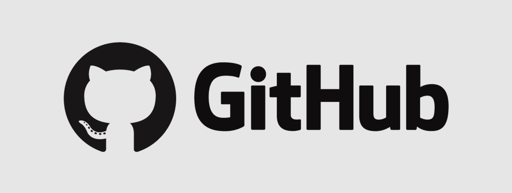
</p>

- Git + Hub
- Git은 버전 관리 도구 → 이걸 좀 더 편하게 쓸 수 있도록 만든 플랫폼 : 깃허브
- 왜 써야해요?
    - 백업 (특히 버전 단위로!)
    - 협업 수월 (동시에 작업 가능)
    - 공유 가능
- 용어 정리
    - Repository : 프로젝트 폴더
    - Clone : 깃허브에서 레포 다운로드
    - Commit : 로컬 저장
    - Push : 깃허브 업로드
    - Pull : 깃허브 변경사항 다운로드
    - Branch : 독립된 작업 공간
    - Pull Request : Branch를 Main으로 합칠 때
    - Issue : 버그/할 일 등 적어놓는 용도

## 가상환경이 뭐예요?

<p align="center">
  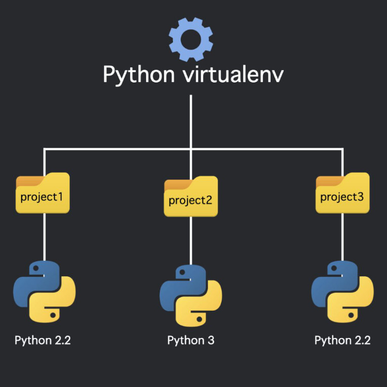
</p>

- 가상환경 : 독립된 파이썬 실행 환경
- 프로젝트마다 알맞는 라이브러리 버전 쓰도록 해줌!

---

# 4. 개발 환경을 구축해보자!

## a. 파이썬 다운로드
<a href="https://python.org">파이썬 다운로드</a>로 이동해 다운로드하기
<p>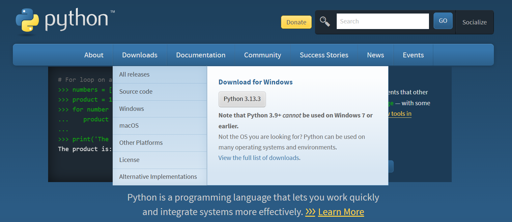</p>

!! 중요 !! Add Path 꼭 해주기!
<p>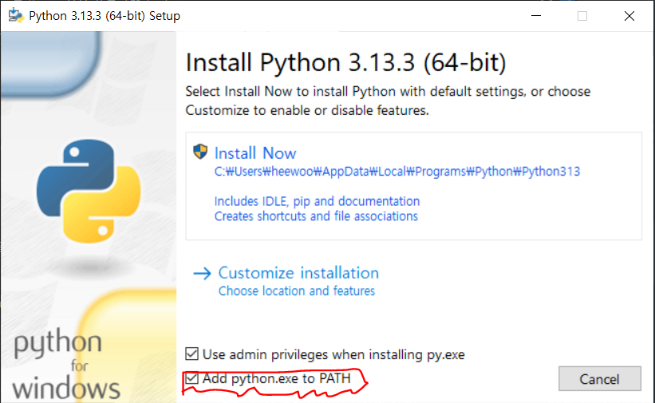</p>

## b. VS code 다운로드
<a href="https://code.visualstudio.com">Visual Studio Code 다운로드</a>로 이동해 다운로드하기
<p>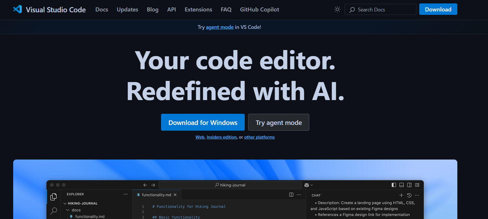</p>

전부 기본 설정 + 동의 후 설치하기
<p>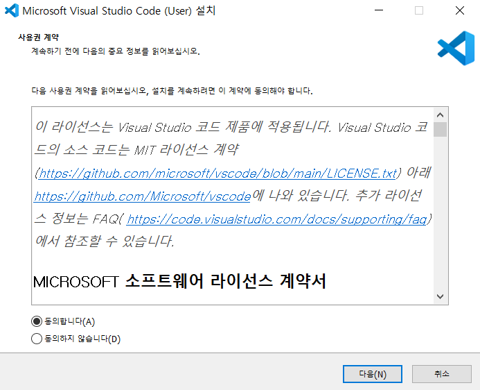</p>

Python Extension 설치하기
<p>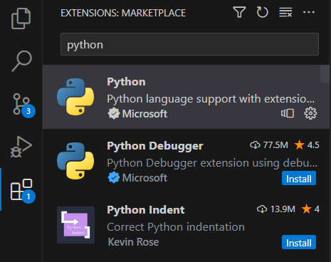</p>

Pylance Extension 설치하기
<p>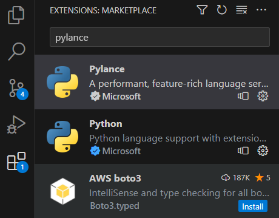</p>

(선택) Color theme 고르기 (추천 : One Dark Pro)
<p>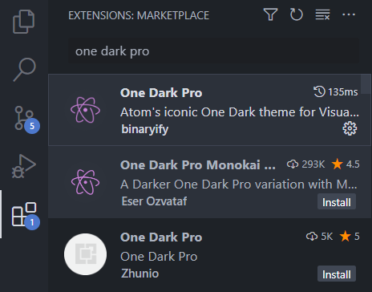</p>

(선택) Font size 조절하기

-> CTRL + , = 설정 열기<br>
-> Font 검색<br>
-> Font Size 변경하기!

## c. Github Desktop 다운로드

<a href="https://github.com/">깃허브 바로가기</a>로 이동해 깃허브 회원가입 하기
<p>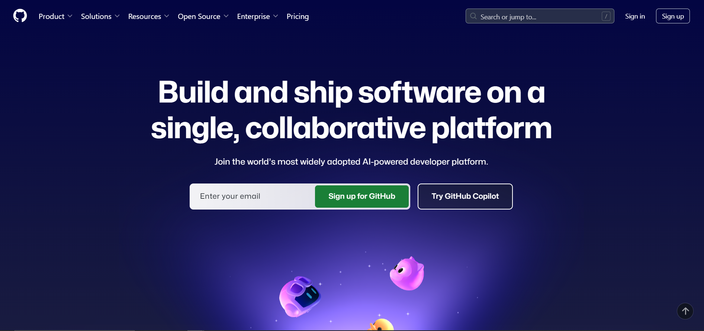</p>

<a href="https://desktop.github.com/download/">Github Desktop 다운로드</a>로 이동해 다운로드하기
<p>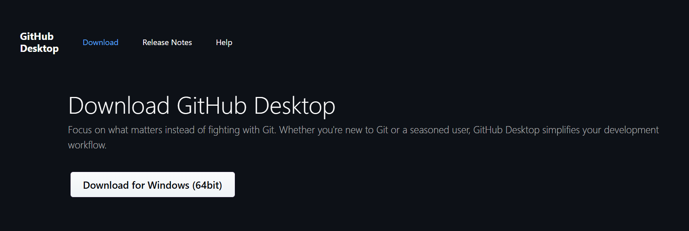</p>

Github Desktop에서 Github로 로그인하기
<p>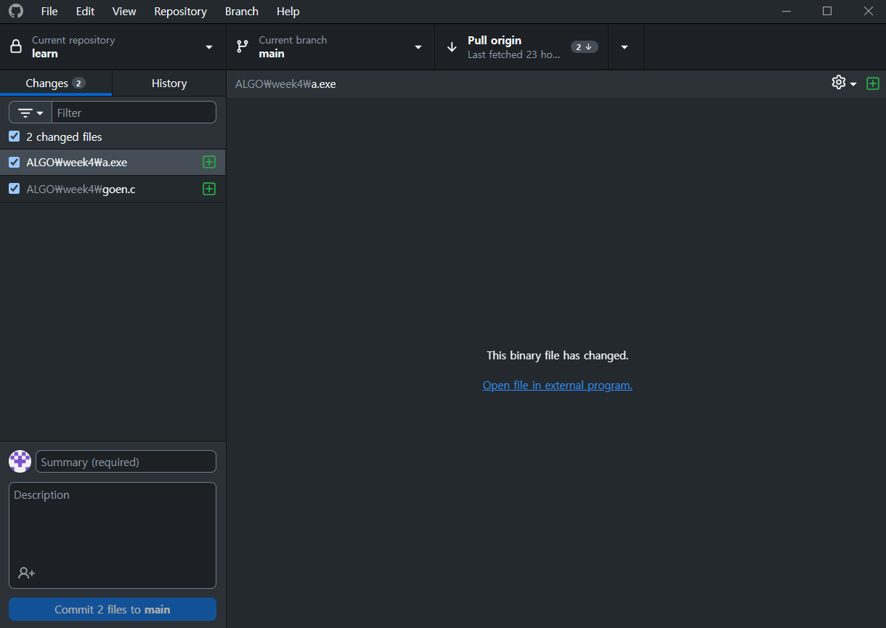</p>

## d. 실행방법 정리

- "Test" 이름의 프로젝트를 생성하는 과정!

### 프로젝트 폴더 생성

Github Desktop에서 Repo 생성<br>
(Add -> Create new repository)
<p>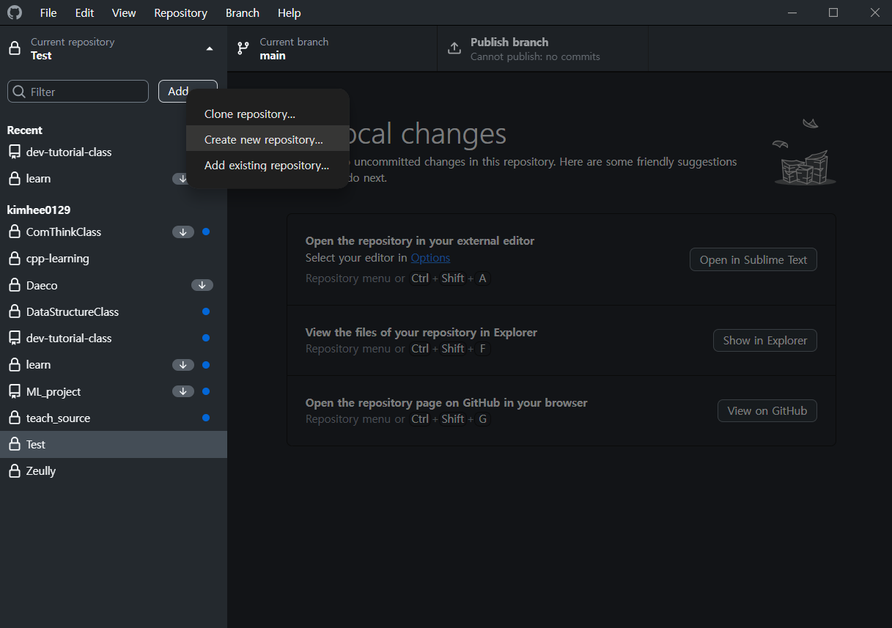</p>
<p>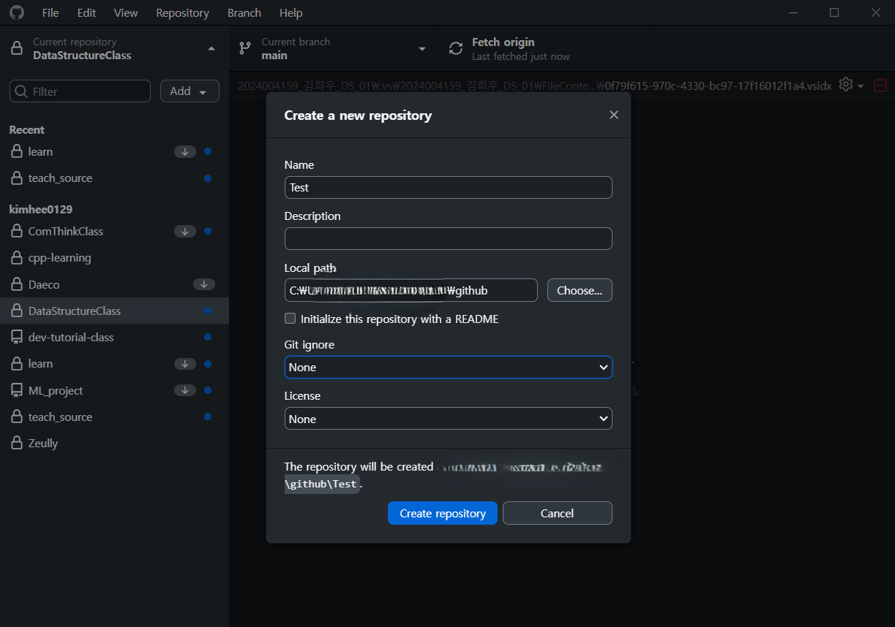</p>

Github Desktop에서 Publish repository 실행 (기본값으로 실행)
<p>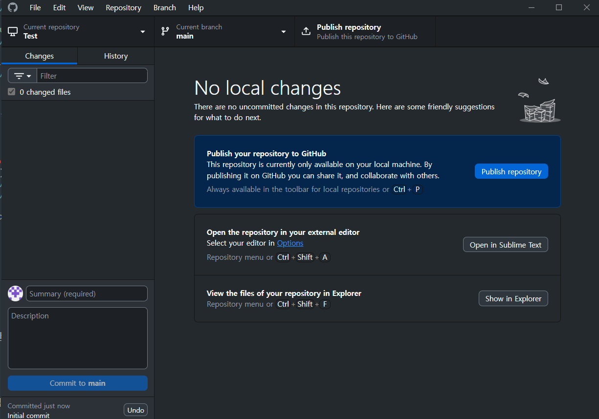</p>

---

### 가상환경 설정
CMD 실행<br>
(Win + R -> cmd + Enter)
<p>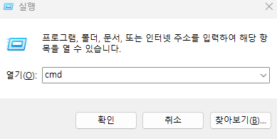</p>

프로젝트 폴더로 이동해 경로 복사
<p></p>

CMD에서 프로젝트 폴더로 이동하기
```bash
cd C:\???\Test
```

가상환경 만들기 (myenv는 마음대로 바꾸기!)<br>
```bash
python -m venv myenv
```

가상환경 활성화하기
```bash
myenv\Scripts\activate
```

(선택) 필요한 라이브러리 설치<br>
```bash
 pip install pygame
 ```

(선택) .gitignore 만들기 -> 최상위 디렉터리에 파일 만들기
```gitignore:.gitignore
# 가상환경
myenv/
.env/

# 파이썬 캐시
__pycache__/
*.py[cod]
*.pyo
*.pyd
```

### 3. VS code 설정

VS code 실행하기
<p>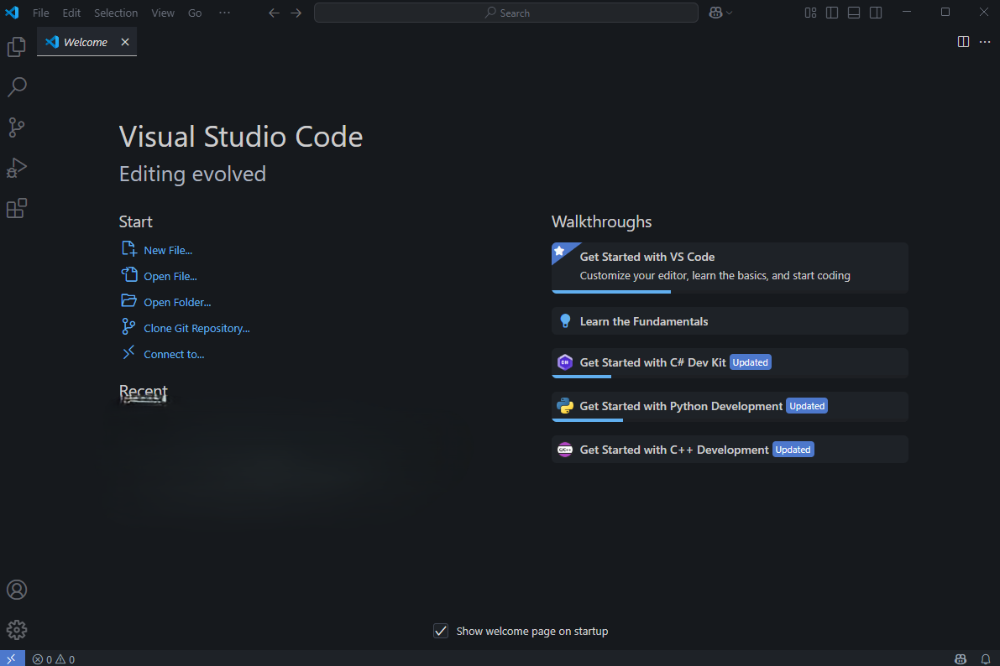</p>

File - Open Folder... - 프로젝트 폴더 선택하기
<p>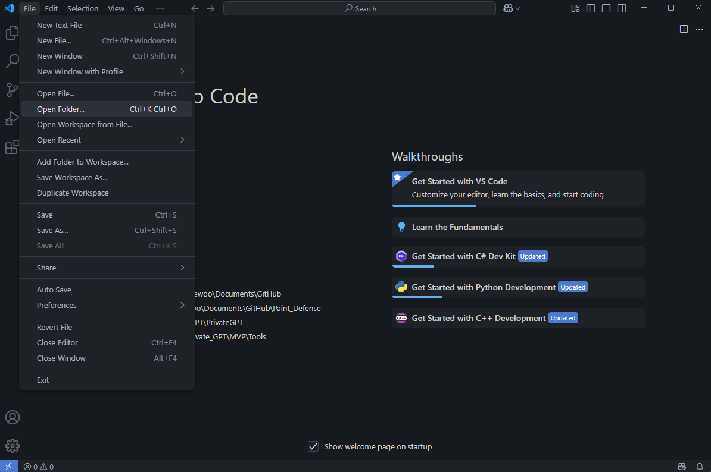</p>

New File - 1.py 만들기
<p>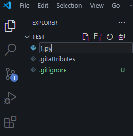</p>

코딩하기!!
```python:1.py
print("Hello, World!")
```

인터프리터 선택하기 : <br>
Ctrl + Shift + P로 명령 팔레트 열기<br>
-> inter 검색하기<br>
-> Python : Select Interpreter 선택하기
-> 위에서 만든 가상환경 선택하기
<p>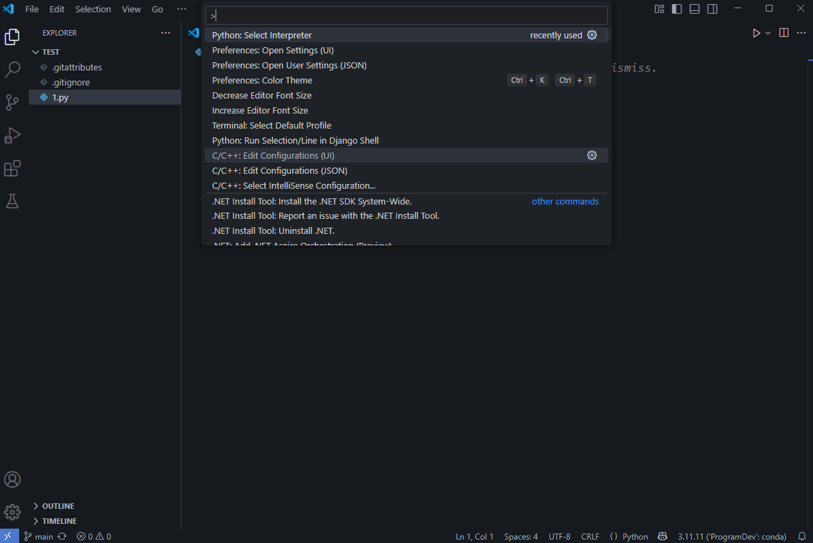</p>

### 4. VS code에서 실행하기

실행할 파일을 열고 F5를 누르기<br>
-> Python Debugger
-> Python file

### 5. Git Commit + Push

Github Desktop을 열고 커밋 메시지 작성<br>
-> 푸시 누르기
<p>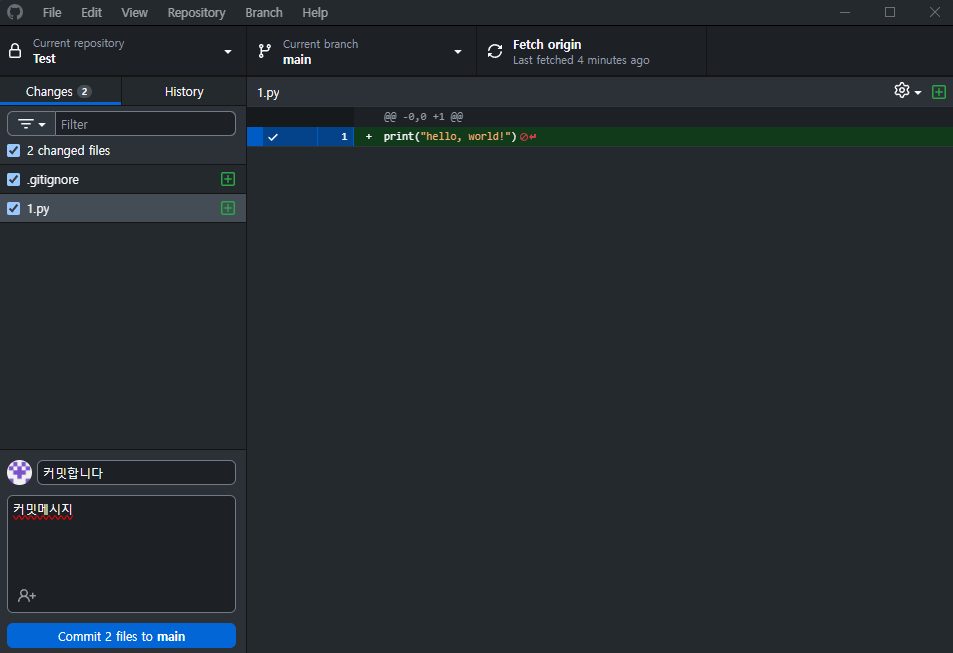</p>

---

# 5. 파이썬 개발 공부법

## A) 파이썬 기초 문법 공부하기

- wikidocs -> <a href="https://wikidocs.net/book/1">점프 투 파이썬</a>
- <a href="https://www.acmicpc.net/">백준</a>
- 공부한 내용 바탕으로 뭔가를 만들어보면 실력 매우 상승!

## B) 파이썬 라이브러리 공부

- 라이브러리에 해당하는 책

ㄴ 왜냐하면 인터넷 자료는 단편적이지만, 책은 흐름이 있고 많은 것을 배우게 해줌.

## C) 개발 시작

- 공부를 완벽히 하고 시작 (X)
- 공부 조금하고 개발하면서 배우자 (O)
- LLM, Stackoverflow, Reddit, 구글검색 활용하기!

---

# 6. 파이썬으로 할 수 있는 것은?

## 🧠 1. 인공지능 & 머신러닝

- **딥러닝**: TensorFlow, PyTorch
- **머신러닝**: scikit-learn
- **자연어 처리**: HuggingFace Transformers, NLTK
- **음성/이미지 분석**: OpenCV, librosa, mediapipe
- 활용: 챗봇, 이미지 분류, 음성인식, 추천 시스템 등

## 📊 2. 데이터 분석 & 시각화

- **데이터 처리**: pandas, numpy
- **시각화**: matplotlib, seaborn, plotly
- **빅데이터**: pyspark, Dask
- 활용: 통계 분석, 데이터 대시보드, 인사이트 도출

## 🌐 3. 웹 개발

- **백엔드 프레임워크**: Django, Flask, FastAPI
- **REST API 서버**: FastAPI로 빠르게 구축 가능
- 활용: 블로그, 쇼핑몰, 게시판, API 서버

## 🧪 4. 자동화 & 스크립트

- **파일/폴더 자동 정리**
- **크롤링**: requests, BeautifulSoup, Selenium
- **엑셀 자동화**: openpyxl, pandas
- **업무 자동화**: 스케줄링, 매크로, 반복 작업 처리
- 활용: 웹 자동 로그인, 파일 이름 일괄변경, 보고서 자동 생성

## 🎮 5. 게임 개발

- **2D 게임**: pygame
- 활용: 간단한 미니게임

## 🖥️ 6. 데스크탑 & GUI 앱

- **GUI 라이브러리**: tkinter, PyQt, Kivy
- 활용: 계산기, 메모 앱, 채팅 프로그램, 파일 변환기

## 🤖 7. 하드웨어 제어 / IoT / 로보틱스

- **Raspberry Pi + Python**: GPIO 제어, 센서 연결
- **드론/로봇 프로그래밍**: ROS, OpenCV 등
- 활용: 스마트홈, 자율주행 실험, 센서 기반 프로젝트

## 🧩 8. 기타 활용

- **알고리즘 문제풀이** (코딩테스트 준비)
- **PDF, 이미지, 영상 처리**
- **보안 / 해킹 실습**
- **음악/예술 분야 실험 (e.g. generative art)**

# 7. 질의응답

편하게 궁금한 점 여쭤보세요!